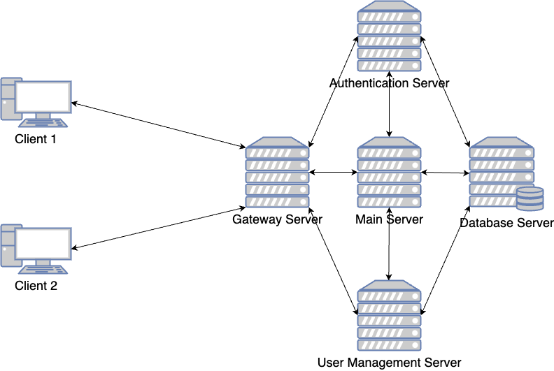

# Simple_MOBA_Server_Simulator

## Description

The project is meant to simulate the interactions between the servers of a multiplayer game.

### **How to use this document:**

1. **If you want a quick start of the project, follow the steps in sequence:**

    1. Please go through **Installation Guide**. The section contains all the preparations and the requirements of the project.
    2. Please then go to **Getting Started**. The section is about how to starts the servers. Note that because each server would not work on its own, it's better to start all the servers.
    3. Finally go to **End points and Usage Examples** to see how to use each feature.
2. If you want to know more about the project:

    * **Architecture and Route** describes how all the servers are cooperating.
    * **Features** section is the blueprint/design of the whole project.
    * **Other Resources** section contains addtional and interesting resources.

### Content

* Description
* Architecture and Route
* Features
* Installation Guide
* Getting Started
* End points and Usage Examples
* Other Resources

### Architecture and Route



* **Client and Frontend (HTML)**

  The whole application will displayed on browser webpage (as a client).

  All request heading to backend need to first make communication with Gateway Server.
  (Exception: After verified, in order to reduce delay, the player will communicate directly with Main Server)
* **Gateway Server (Node js)**

  According to the address of the request, the Gateway Server will forward the request to different directions.

  A gateway server can help both distributing the flow of data and preventing the client to contacting the backend without permission. (It can be set in backend servers that only the connections and requests from gateway server is allowed. )
* **Authentification Server (Node js)**

  The Authentification Server is used to verify user account. It receive the request and data package forwarded by Gateway Server originally from client, then compare the request data with the data stored in database. If verified, it will generate a secure key, and send a package (contain the username and the key in pair) simultaneously to both the client and the Main Server. The "two" key must be matched so that the request is allowed to visit the mainpage.

  Metaphorically speaking, the Authentification Server is like the hotel reception. It checks that the visitor is the one who has reserved a room, and give the visitor a unique door card to open the room.
* **Main Gaming Server (Node js)**

  The Main Server is core section of the whole project. It uses socket to communicate with the clients. Once a client is successfully connected, the Main Server will hold the connection and keep receiving and broadcasting messages and data packages.

  In my understanding, the normal HTTP protocol and the socket protocol are like communicating by email and by phone call. Although theoretically if you can write and read the email in a incredibly fast speed, it would also have an effect like real-time process with imperceptible delay.
* **User Management Server (Django)**

  The User Management Server is mainly for the purpose of initializing the models of the database, and handling the requests for static request like registration, charcter creation and profile management.
* **Database Server (MySQL)**

  The SQL Server will restore relational data all about the project.


### Features Designed

Please note this part is mainly about the design of all functions. To see the practical usages, please refer to 'Usage Examples'

* **Login, Registration and Authentification**

  Account is the unique identificatio of player to register/login.

  The player need to have an account for further functions.

  * **Registration**

    New user need to input account and password to create new entity.

    The account should not be used before in current database.

    The password need to be at leat 8 character long.
  * **Login and Authentification (double authentification steps**)

    The shining point of this system is that, it requires confirm and match from mutiple directions to verify if the login request is legal.

    Please refer to the architecture diagram above for better understanding.

    1. After taking the username and the password from input, the client will send to the Gateway server a request to login and a package of username and password.
    2. The Gateway Server recognizes the login request and forwards the package to the Authentification Server.
    3. The Authentification Server will compare the received data with the one in database. Only if the user information is verified, the process will continue.
    4. If the Authentification Server has checked the data is valid, it will then generate a secure key.
    5. Then the Authentification Server will simultaneously send the pair of data (the username as index and the secure key as value) to the Main Server and send the secure key alone back to the client.
    6. Finally, the client should send the key it received to the Main Server. The Main Server will temporarily store the pairs of data in a list for convenience. Then, the Main Server compares the key from client and in the list. If the key matched, then the client will be allow to have access to the main page.
* **Player Profile**

  * **Player**

    Player is the user of the application.

    This entity is designed to be **unique** for every user.

    * The public attributes (the player can see and modify some):

      * account and password
      * level and experience Points
      * number of wins and loses (the total number of all characters)

    * The private attributes (the player is forbiddened to see and to modify):

      * <u>Matchingmaking Ranking (the index for matching and ranking!)</u>
  * **Character**

    Character is the avatar (virtual projection) of player.

    Every user can have up to **10** characters.

    * The public attributes (the player can see and modify some):

      * name of the avatar
      * class (such as Healer, Defender or Attacter)
      * number of wins and loses
    * The private attributes (the player is forbiddened to see and to modify):

      * player (who is the owner)
* **Real-time Gaming and** **Chat Box**

  This part is supposed to be the main body of the whole project.

  In order to achieve the effect of real-time gaming and chatting here, Socket protocol is used to substitute for HTTP protocol.

  * Game Canvas

    * place for visual elements of game (picture, timer, HP)
  * Chat Box

    * history message

      * place for boardcasting message from server or from other player, and displaying history input
    * input form

      * place for inputing command (for example to attack)
* **Ranking and Level**

  Still in developing

## Installation Guide

**<u>Please follow and check the steps before to prepare for the project.</u>**

For general the project require:

* Python 3
* Node js
* MySQL

1. **Install Mysql Community Server**

     **(Very important!) Install and make sure your MySQL server works properly**

    Here are the official documents of MySQL Server. (Containing all popular system)

    * [Download MySQL Community Server](https://dev.mysql.com/downloads/mysql/)
    * [Get Started with MySQL](https://dev.mysql.com/doc/mysql-getting-started/en/)

     **(Very important!) Make sure you have successfully build a MySQL connection**

    * Check List (will be used later):

      * your username of the connection (usually name **​`root`​** in default)
      * your password (recommend: **​`hellomysql`​**, so that no need to modify settings in codes)
      * name of the database (in the default setting in my code it is **​`Moba_Simulator`​**, however this is changable if you want to build your own one)
      * host (usually offline it should be **localhost (127.0.0.1)** )
      * port (in default 3306)

    Here are some additional tutorials and resources if you meet difficulties.

    * Tutorial to install MySQL server and visualization database controlling platform
      [https://www.youtube.com/watch?v=7S_tz1z_5bA&amp;t=65s](https://www.youtube.com/watch?v=7S_tz1z_5bA&t=65s)
    * Tutorial to connect Django and MySQL server
      [https://studygyaan.com/django/how-to-use-mysql-database-with-django-project](https://studygyaan.com/django/how-to-use-mysql-database-with-django-project)
      [https://www.youtube.com/watch?v=SNyCV8vOr-g&amp;t=49s](https://www.youtube.com/watch?v=SNyCV8vOr-g&t=49s)
    * If you have problem on Mac when installing MySQL client in python
      [https://stackoverflow.com/questions/66669728/trouble-installing-mysql-client-on-mac](https://stackoverflow.com/questions/66669728/trouble-installing-mysql-client-on-mac)
2. **Install Node js and npm**

    Node js and npm is mandantory to run this project. According to different systems the way to install may differ. Make sure npm is also installed.(usually they are binded)

    * [Node js](https://nodejs.org/en)

    To verify the installation of Node js and npm, run:

    ```bash
    node -v
    npm -v
    ```

    Other Tips:

    * If you have problem on MacOS when installing, you can try [Homebrew](https://brew.sh/). It is like environment package manager for MacOS. After installing Homebrew, you can use it to install, run:

      ```bash
      brew install node
      ```
    * For me it is always a good idea to seek for the help of Homebrew, when meeting trouble installing environments on MacOS.
3. **Install Python**

    Make sure Python 3 is installed on your device.


## Getting Started

1. **Clone Repository**

    Make sure you know how to use git command; or you can use [Github Desktop](https://desktop.github.com/) without using commands for convinence.

    ```bash
    git clone https://github.com/lzpmpc005/Simple_MOBA_Server_Simulator.git
    ```

    Get into the file (according to your file structure)

    ```bash
    cd Simple_MOBA_Server_Simulator
    ```
2. **Install Dependencies**

    For Servers using Node js, make sure you are in the file Simple_MOBA_Server_Simulator and run:

    npm will automatically read the package-json file and install all the dependencies.

    ```bash
    cd authentication_server
    npm install
    cd ../gateway_server
    npm install
    cd ../gaming_main_server
    npm install
    ```

    For Django Server, first back to file Simple_MOBA_Server_Simulator, then run:

    ```bash
    cd user_management_server
    pip install -r requirements.txt
    ```
3. (Optional) Check setting of Database ( if you set up your MySQL connection using your own username and password )

    * In every server folder you will see a file named `main.js`, `auth.js` or `gateway.js`.
    * Open and check if there are settings like:

      ```bash
      const pool = mysql.createPool({
          connectionLimit: 10,
          host: 'localhost',
          port: '3306',
          user: 'root',
          password: 'hellomysql',
          database: 'Moba_Simulator'
        });
      ```
    * In Django Server, go `user_management_server` --> `user_management`, find a file named settings.py and open it, you may see settings like:

      ```bash
      DATABASES = {
          'default': {
              'ENGINE': 'django.db.backends.mysql',
              'NAME': 'Moba_Simulator',
              'USER': 'root',
              'PASSWORD': 'hellomysql',
              'HOST': 'localhost',
              'PORT': '3306',
          }
      }
      ```
    * If you have use any parameter other than the one showed above, you need to change to yours. Otherwise the connection between will not be set properly.
4. **Migrate Database using python**

    After everything below checked, you should initialize your database.

    * make sure you are in `user_management_server` directory
    * run:

      ```bash
      python manage.py makemigrations
      ```

      ```bash
      python manage.py migrate
      ```
5. **Start Servers**

    The final step is to start server. Either you can manually run each one or try:

    ```bash
    # Start Authentication Server
    cd authentication_server
    node auth.js

    # Start Gateway Server
    cd ../gateway_server
    node gateway.js

    # Start Main Server
    cd ../gaming_main_server
    node main.js

    # Start User Management Server
    cd ../user_management_server
    python manage.py runserver
    ```

## End Points and Usage Examples

Before starting, make sure all the servers are running properly.

For the first 2 completed endpoints, use the browser to see effects. Click [here](http://localhost:3000/) to try the main flow of the project.

For the rest of uncompleted endpoints, it is recommended to use [Postman](https://www.postman.com/) (click the link to register and download) to test. Here is also [the official tutorial](https://learning.postman.com/docs/getting-started/overview/) for Postman.

* Register and Create Player

  1. go to [http://localhost:3000/]()
  2. input username and password (more than 8 characters)
  3. if successed, you will stay at the same page
* Login

  1. should have register first
  2. go to [http://localhost:3000/]()
  3. input username and password
  4. if successed, you will see the main framework of the game canvas
* Create Character

  Here you need to use Postman to send and receive request and response

  url used: [http://127.0.0.1:2000/django/player/create_character/](http://127.0.0.1:2000/django/player/create_character/)

  * To receive success response, make sure:

    1. you have registered successfully before
    2. there is at least one data in Table: player\_profile\_characterclass in database

  request example:

  ```bash
  {
      "name": "Ora",
      "account": "user123",
      "character_type": "Healer"
  }
  ```
* ~~Match other player according to Matchingmaking Ranking~~
* ~~Record and Update Player Status~~

  ~~p.s. If player is currently in blacklist, login and connection are not allowed~~
* ~~Record Message~~


## Other Resources

https://scripterswar.com/tutorial/nodejs

https://socket.io/